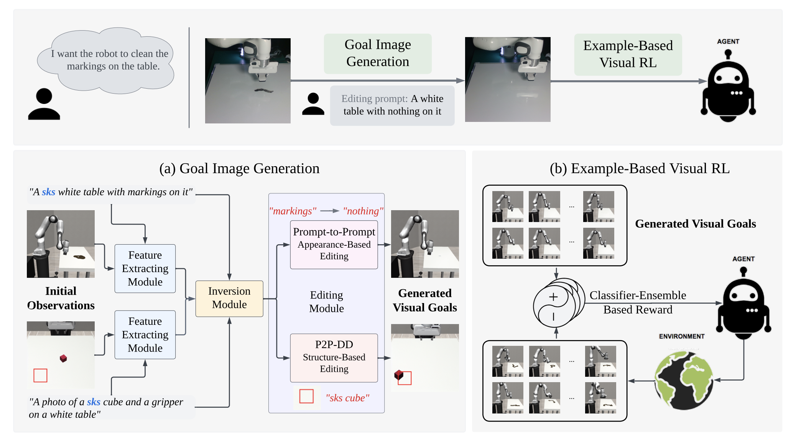
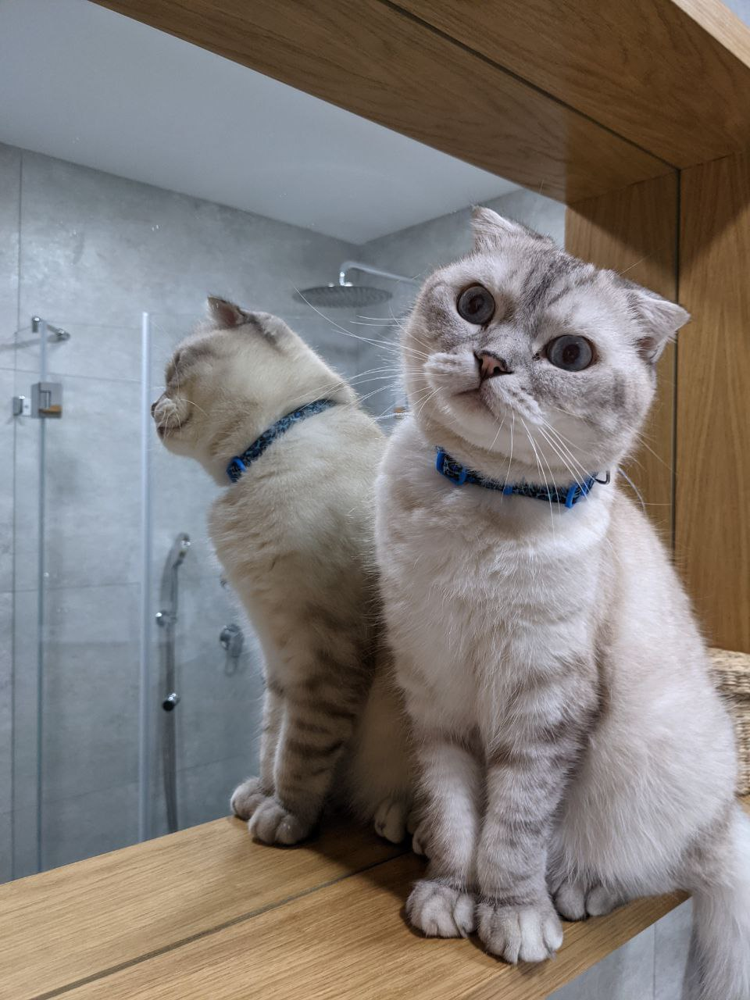
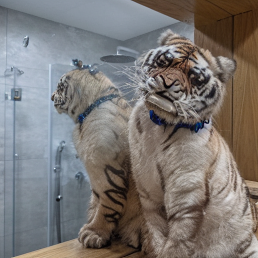
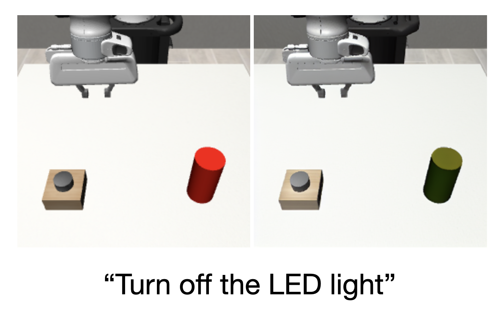
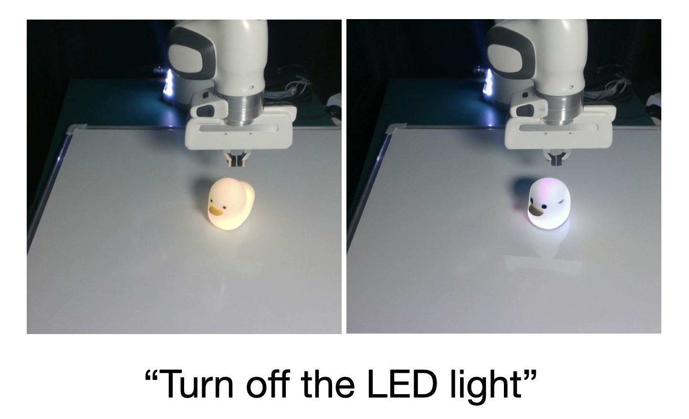
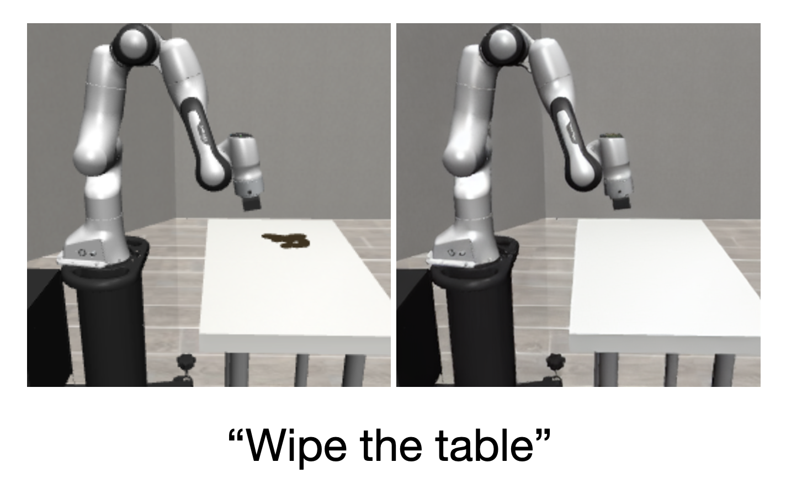
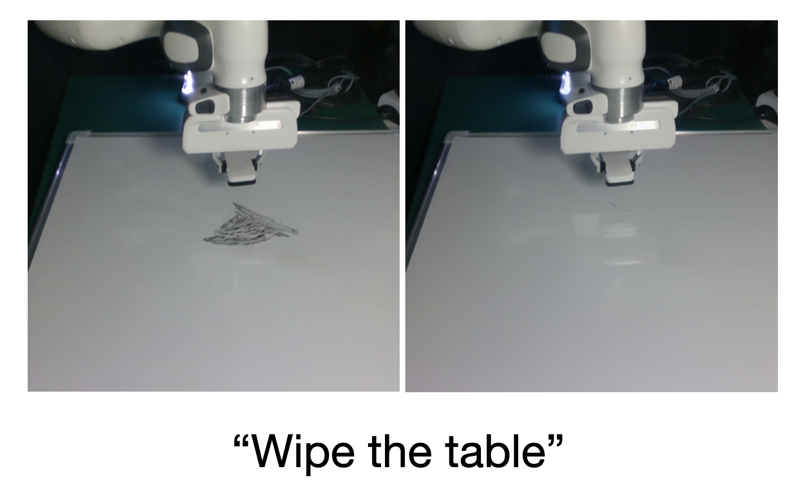
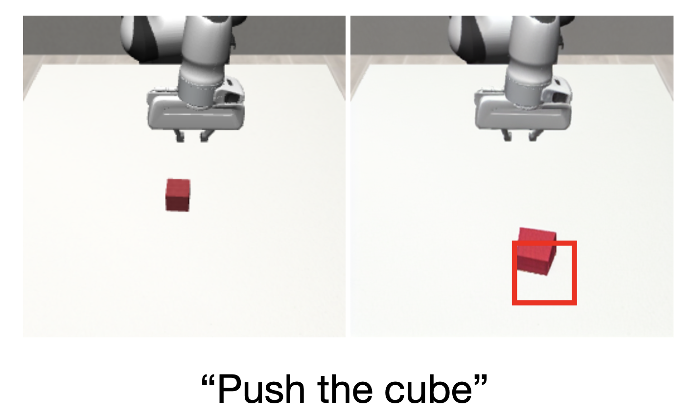
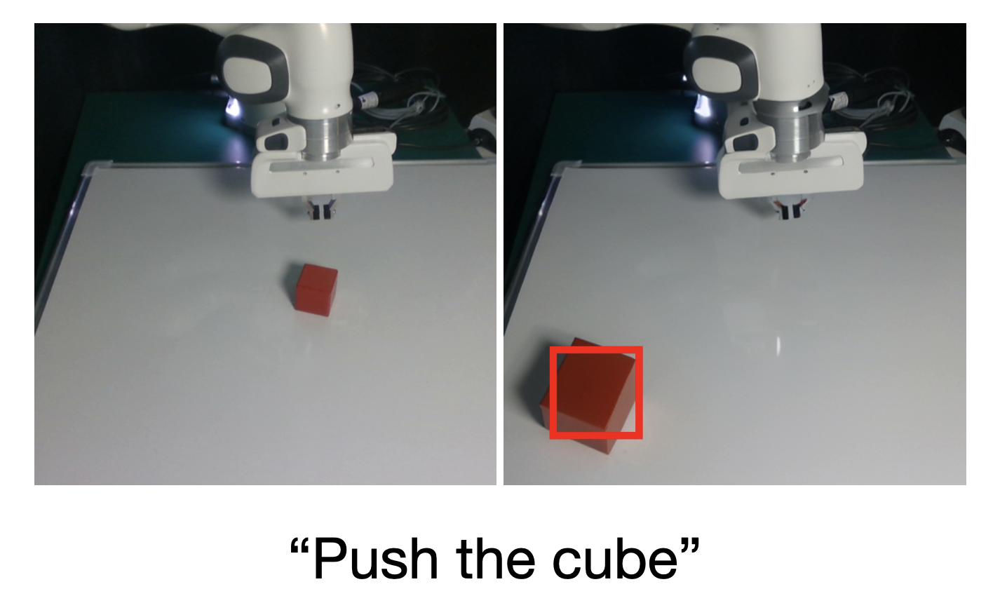

# LfVoid: Can Pre-Trained Text-to-Image Models Generate Visual Goals for Reinforcement Learning?
[Website](https://lfvoid-rl.github.io/) | [Paper](https://proceedings.neurips.cc/paper_files/paper/2023/file/7866ff509c822c2e58d20d00154a15a2-Paper-Conference.pdf)

We propose Learning from the Void (LfVoid), a method that leverages the power of pre-trained text-to-image models and advanced image editing techniques
to guide robot learning. Given natural language instructions, LfVoid can edit the original observations to obtain goal images, such as “wiping” a stain off a table. Subsequently, LfVoid trains an ensembled goal discriminator on the generated image to provide reward signals for a reinforcement learning agent, guiding it to achieve the goal. The ability of LfVoid to learn with zero in-domain training on expert demonstrations or true goal observations (the void) is attributed to the utilization of knowledge from web-scale generative models. We evaluate LfVoid across three simulated tasks and validate its feasibility in the corresponding realworld scenarios. In addition, we offer insights into the key considerations for the effective integration of visual generative models into robot learning workflows. We posit that our work represents an initial step towards the broader application of pre-trained visual generative models in the robotics field.

<p align="center">

</p>


# Installation

The code was tested on NVIDIA RTX A4500 (20GB VRAM).

## 1. Create Virtual Environment
We recommend creating a conda environment to run the scripts.
```
conda create -n lfvoid python=3.8
```

Then activate the environment:
```
conda activate lfvoid
```

## 2. Install Packages and Repos
We provide an all-in-one script for installation in [setup.sh](./setup.sh)

First, install Pytorch according to the CUDA version on your machine
```
# example cuda version: 12.1
# please check the CUDA version on your machine and adjust accordingly
# https://pytorch.org/get-started/previous-versions/
pip install torch==2.4.1 torchvision==0.19.1 --index-url https://download.pytorch.org/whl/cu121
```

Next, install the rest of the dependencies:
```
bash setup.sh
```
It will download the required github repos and install the required packages for you. 


## 3. Verify the Environment
Once you have the environment installed, you can run the following command to verify whether the installation is correct.
```
bash test_env.sh
```


It will pass in the following input image and trying to edit the **cat** into a **tiger** while keeping everything unchanged.

<p align="center">

</p>

If everything is correct, you will see a new directory under ```./outputs``` with images looking like this:

<p align="center">

</p>


# Goal Image Generation
The first part includes instructions on how to run the core code of generating goal images for various table-top robot manipulation tasks.

|  Generation Type    |   Task Name   | Step 1 | Step 2 | 
| ---- | ---- | ---- | ---- |
|   Appearance-based editing   |   [LED-Sim](#led-sim)   |   /   |   editing   |
|   Appearance-based editing   |   [LED-Real](#led-real)   |   /   |   editing   |
|   Appearance-based editing   |   [Wipe-Sim](#wipe-sim)   |   Dreambooth   |   editing   |
|   Appearance-based editing   |   [Wipe-Real](#wipe-real)   |   Dreambooth   |   editing   |
|   Structure-based editing   |   [Push-Sim](#push-sim)   |   Dreambooth   |   editing   |
|   Structure-based editing   |   [Push-Real](#push-real)   |   Dreambooth   |   editing   |

## Appearance-based Editing

The algorithm for performing appearance-based is in the script [editing_appearance.py](./editing_appearance.py). 

Here is a list of the parameters that can be passed into the script:
- --prompt: The text prompt describing the **source** image
- --edit_prompt: The text prompt describing the **target** image
- --image_path: The path to the input image that needs to be edited
- --experiment_name: The name of this experiment, which will be used to construct the output image path
- --device: The device to run the script on, for example, "cpu", "cuda:0".

The following parameters share the same meaning as the original [Prompt-to-prompt](https://github.com/google/prompt-to-prompt)  codebase.
- --amplify_word: Choose a word from the target text prompt that needs to be emphasized
- --amplify_weight: The weight to emphasize the word
- --self_replace_step: The percentage to perform self-attention map replacement. Range from 0 to 1.0
- --blend_word1: The word from the source prompt that describes the region of the edit
- --blend_word2: The word from the target prompt that describes the region of the edit


    
### LED-Sim
<p align="center">

</p>

We provide an example bash script for Simulated LED Task: [script/run_led_sim.sh](./scripts/run_led_sim.sh)

### LED-Real
<p align="center">

</p>

We provide an example bash script for Real-world LED Task: [script/run_led_real.sh](./scripts/run_led_real.sh)


### Wipe-Sim
<p align="center">

</p>

We provide an example bash script for Simulated Wipe Task: [script/run_wipe_sim.sh](./scripts/run_wipe_sim.sh)

### Wipe-Real
<p align="center">

</p>

We provide an example bash script for Real-world Wipe Task: [script/run_wipe_real.sh](./scripts/run_wipe_real.sh)


## Structure-based Editing

The algorithm for performing appearance-based is in the script [editing_structure.py](./editing_structure.py). 

Here is a list of the parameters that can be passed into the script:
- --prompt: The text prompt describing the scene
- --image_path: The path to the input image that needs to be edited
- --experiment_name: The name of this experiment, which will be used to construct the output image path
- --region: The bounding-box that describes the region which the desired object should appear in. For example, "0.5 0.7 0.7 0.9" suggest a bounding-box at $x_{start}=0.5*width, x_{end}=0.7*width, y_{start}=0.7*height, y_{end}=0.9*height$
- --prompt_indice: The idx of the words in the prompt that specifies the object to be moved
- --num_trailing_maps: The number of extra trailing tokens to add
- --editing_steps: The number of editing steps (integer)
- --plot_region: If added, the script will plot the bounding-box in the edited image
- --device: The device to run the script on, for example, "cpu", "cuda:0".


### Push-Sim
<p align="center">

</p>

We provide an example bash script for Simulated Push Task: [script/run_push_sim.sh](./scripts/run_push_sim.sh)

### Push-Real
<p align="center">

</p>

We provide an example bash script for Real-world Push Task: [script/run_push_real.sh](./scripts/run_push_real.sh)


# Acknowledgement

This project is developed based on:

- [Prompt-to-prompt](https://github.com/google/prompt-to-prompt) 

- [DirectedDiffusion](https://github.com/hohonu-vicml/DirectedDiffusion)

We thank the authors for their contributions!


The repo is a re-implementation of the code used in the paper, as we clean up and refactor the code with to the newest diffusers (0.31.0.dev0).

# Citation

If you find this code useful, consider citing our work:

```bibtex
@misc{gao2023pretrainedtexttoimagemodelsgenerate,
      title={Can Pre-Trained Text-to-Image Models Generate Visual Goals for Reinforcement Learning?}, 
      author={Jialu Gao and Kaizhe Hu and Guowei Xu and Huazhe Xu},
      year={2023},
      eprint={2307.07837},
      archivePrefix={arXiv},
      primaryClass={cs.RO},
      url={https://arxiv.org/abs/2307.07837}, 
}
```